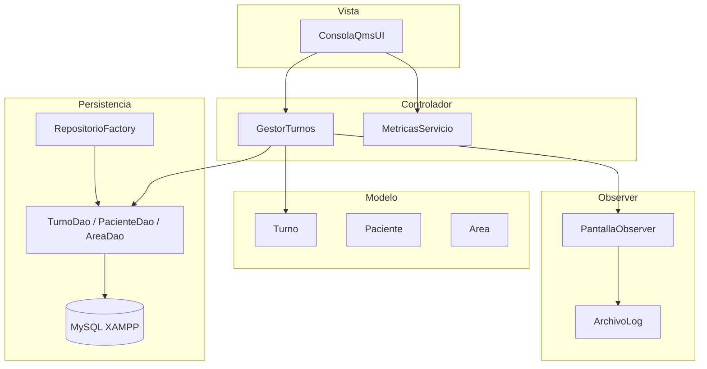
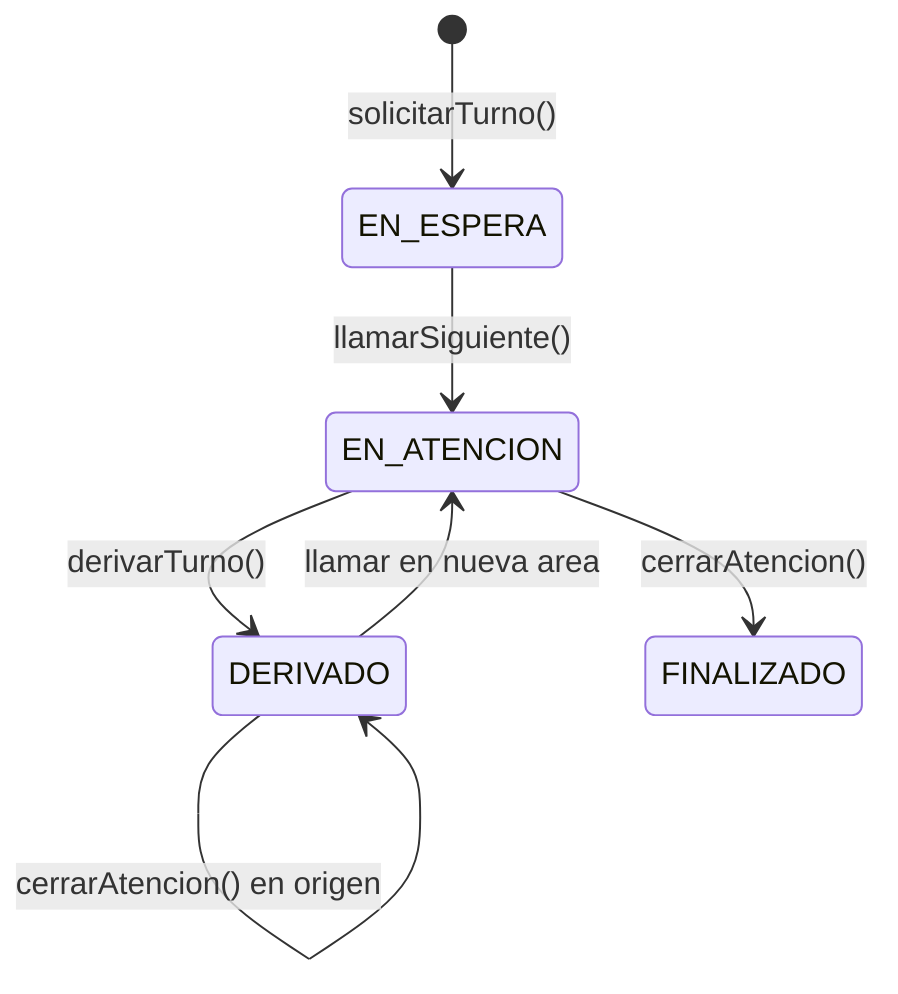

# Explicación del Desarrollo en Java — Módulo 4

## 1. Objetivo del módulo

El **Sistema QMS (Queue Management System)** para clínica médica digitaliza la gestión de turnos: emisión por DNI, colas por área, llamado desde boxes, derivación con prioridad, persistencia en **MySQL (XAMPP)** y registro en **archivo de log**. El desarrollo aplica **POO**, **MVC**, **DAO**, **Singleton**, **Observer**, **ArrayList**, **arrays**, **excepciones** y **JDBC**.

---

## 2. Estructura del proyecto y componentes

```
proyectoMod4/
├── src/main/java/com/clinica/qms/
│   ├── App.java                 → Punto de entrada; arma dependencias y lanza la UI
│   ├── db/ConexionDB.java       → Singleton JDBC a MySQL/XAMPP
│   ├── dao/                     → Acceso a datos (MySQL + memoria)
│   ├── model/                   → Entidades del dominio
│   ├── service/                 → Lógica de negocio y métricas
│   ├── view/ConsolaQmsUI.java   → Menús de consola (Vista MVC)
│   ├── observer/                → Notificaciones (pantalla + log)
│   ├── exception/               → Excepciones propias del sistema
│   ├── util/                    → Log en archivo, consola con colores, ordenamiento
│   └── tests/QmsUnitTests.java  → Pruebas CP-01, CP-02, CP-03
├── db/clinica_qms_mod4.sql      → Script de base de datos
├── docs/GUIA.md                 → Guía de ejecución y uso
└── logs/qms_audit.log           → Log generado al ejecutar (no versionado)
```

### 2.1. Rol de cada capa

| Paquete / clase | Responsabilidad |
|-----------------|-----------------|
| **model** | Representa el dominio: `Paciente`, `Turno`, `Area`, `Box`, `Operador`, `EstadoTurno`. Contiene métodos de negocio del turno (`marcarLlamado`, `derivar`, `finalizarAtencion`). |
| **service** | `GestorTurnos` orquesta colas, llamados, derivaciones y notifica observers. `MetricasServicio` calcula promedios y genera reporte en `String[]`. |
| **dao** | Interfaces (`TurnoDao`, `PacienteDao`, `AreaDao`, `IDao`) e implementaciones MySQL y memoria. `RepositorioFactory` elige la fuente según conexión. |
| **db** | `ConexionDB` (Singleton) centraliza la conexión JDBC. |
| **view** | `ConsolaQmsUI` muestra menús, lee entrada del usuario y delega al servicio. |
| **observer** | `ConsolaSalaEsperaObserver` y `ArchivoLogObserver` reaccionan a eventos del turno. |
| **exception** | `BusinessException` y `DataAccessException` separan errores de reglas vs. persistencia. |
| **util** | `ArchivoLog` (lectura/escritura de archivo), `ConsolaUtil` (colores y limpieza de pantalla), `OrdenamientoBusqueda`. |

### 2.2. Diagrama de capas (MVC + DAO)



---

## 3. Lógica de negocio implementada

La lógica central está en **`GestorTurnos`** y en los métodos de la entidad **`Turno`**. La vista no contiene reglas de negocio: solo invoca al servicio y muestra resultados.

### 3.1. Solicitar turno (autogestión)

1. Buscar paciente por DNI; si no existe, crearlo y persistirlo.
2. Generar código único por área de forma **atómica** (`A-001`, `L-001`) mediante transacción en tabla `consecutivo_turno`.
3. Crear `Turno` en estado `EN_ESPERA`, guardarlo en MySQL y encolarlo en memoria (`LinkedList` por área).

### 3.2. Llamar siguiente turno

1. Verificar que la cola del área del operador no esté vacía; si lo está → `BusinessException`.
2. Extraer el primer turno de la cola (`poll`).
3. Marcar estado `EN_ATENCION`, registrar box y timestamps de llamado e inicio de atención.
4. Asociar el turno al box en `turnoActivoPorBox`.
5. Persistir cambios y **notificar observers** (pantalla pública + log).

### 3.3. Derivar turno

1. Localizar el turno activo en el box del operador.
2. Cambiar área destino, estado `DERIVADO`, `prioridad = 1` y `area_origen`.
3. Insertar al **frente** de la cola del área destino (prioridad alta sobre turnos normales).
4. El mismo código de turno se conserva (ej.: `A-001` pasa a cola de Laboratorio).

### 3.4. Cerrar atención

1. Verificar que haya turno activo en el box; si no → `BusinessException`.
2. Si el turno ya fue derivado: registrar fin de atención **sin** cambiar a `FINALIZADO`.
3. Si no fue derivado: `FINALIZADO` con timestamp de cierre.
4. Liberar el box, persistir y notificar cierre en log.

### 3.5. Métricas

`MetricasServicio` recorre el histórico de turnos y calcula:

- **Turnos atendidos:** con atención cerrada (`timestamp_fin_aten` o estado `FINALIZADO`).
- **Turnos derivados:** estado `DERIVADO` o con `area_origen` registrada.
- **Espera promedio:** desde creación hasta llamado.
- **Atención promedio:** entre inicio y fin de atención.

El reporte se devuelve como **`String[]`**.

### 3.6. Flujo completo de un turno



---

## 4. Tratamiento de excepciones

El sistema distingue **dos tipos de error** mediante excepciones propias que extienden `RuntimeException`:

### 4.1. `BusinessException` — reglas de negocio

| Origen | Ejemplo de mensaje | Cuándo ocurre |
|--------|-------------------|---------------|
| `GestorTurnos.llamarSiguiente` | `"No hay turnos en espera para Administracion"` | Cola vacía |
| `GestorTurnos.derivarTurno` | `"Turno no encontrado: X-999"` | Código inexistente |
| `GestorTurnos.cerrarAtencion` | `"No hay atencion activa en BOX-1"` | Box sin turno activo |

**Representación en consola:** la vista captura la excepción y muestra `[!] mensaje` en **amarillo** (`ConsolaUtil.aviso`).

```java
try {
    gestor.llamarSiguiente(area, box);
} catch (BusinessException e) {
    ConsolaUtil.aviso(e.getMessage());
}
```

### 4.2. `DataAccessException` — acceso a datos

Envuelve fallos de **JDBC**, **MySQL** o **driver**:

| Origen | Ejemplo | Causa típica |
|--------|---------|--------------|
| `ConexionDB` | `"No se pudo conectar a MySQL..."` | XAMPP apagado, base no importada |
| `TurnoDaoMySqlImpl` | `"Error al guardar turno..."` | Error SQL al INSERT/UPDATE |
| `RepositorioFactory` | Capturada al iniciar | Activa **modo demo** (memoria) |

**Representación en consola:** `[ERROR] mensaje` en **rojo** (`ConsolaUtil.error`).

### 4.3. Estrategia de capas

```
Capa DAO     → SQLException / ClassNotFoundException  →  DataAccessException
Capa Service → Validación de reglas                   →  BusinessException
Capa View    → try/catch de ambas                     →  Mensaje al usuario
Capa Util    → IOException en ArchivoLog              →  Mensaje interno / vacío
```

### 4.4. Try-with-resources

En los DAO MySQL se usan **`try (PreparedStatement ps = ...)`** para cerrar recursos JDBC automáticamente y evitar fugas de conexión.

### 4.5. Modo degradado (Factory)

Si `ConexionDB` lanza `DataAccessException`, `RepositorioFactory` **no detiene la aplicación**: construye DAOs en memoria y avisa al usuario. Esto permite probar la UI sin MySQL, pero los datos no persisten.

---

## 5. Menú de selección — descripción y capturas

Los menús están definidos como **arrays de `String`** en `ConsolaQmsUI`. Cada pantalla se limpia antes de mostrarse (`ConsolaUtil.limpiarPantalla()`).

### 5.1. Menú principal

| Opción | Acción | Descripción |
|--------|--------|-------------|
| **1** | Autogestión de paciente | El paciente ingresa DNI, nombre, apellido y elige área. Genera turno (ej. `A-001`). |
| **2** | Login de operador | Ingreso por usuario (`lperez`, `tacosta`, `nruiz`), selección de box y acceso al menú operador. |
| **3** | Sala de espera | Pantalla pública: últimos llamados y cantidad en espera por área. |
| **4** | Ver log de auditoría | Muestra las últimas 10 entradas de `logs/qms_audit.log`. |
| **0** | Salir | Finaliza la aplicación. |

**Captura sugerida:** `docs/capturas/01-menu-principal.png`


### 5.2. Menú operador

| Opción | Acción | Descripción |
|--------|--------|-------------|
| **1** | Ver cola de espera | Lista turnos pendientes del área del operador; marca `[DERIVADO]` si tienen prioridad. |
| **2** | Llamar siguiente turno | Saca el primero de la cola, muestra aviso en pantalla pública (verde) y activa el box. |
| **3** | Derivar turno | Envía el turno activo a otra área con prioridad alta. |
| **4** | Cerrar atención | Registra tiempos de espera/atención y libera el box. |
| **5** | Ver métricas | Reporte de atendidos, derivados y promedios en segundos. |
| **0** | Cerrar sesión | Vuelve al menú principal. |

**Capturas sugeridas:**

| Archivo | Contenido a capturar |
|---------|---------------------|
| `02-autogestion-turno.png` | Pantalla autogestión con turno `A-001` generado |
| `03-login-operador.png` | Login `lperez` y selección de box |
| `04-llamado-turno.png` | Aviso verde `LLAMADO: ==> TURNO A-001...` |
| `05-derivar-turno.png` | Derivación a Laboratorio |
| `06-metricas.png` | Pantalla de métricas con valores |
| `07-sala-espera.png` | Opción 3 del menú principal |
| `08-log-auditoria.png` | Opción 4 del menú principal |
| `09-phpmyadmin-turno.png` | Tabla `turno` en phpMyAdmin con registro persistido |

> **Nota:** Colocá tus capturas de pantalla en la carpeta `docs/capturas/` con esos nombres para que se visualicen en este documento.

---

## 6. Estructura del código y principios POO

### 6.1. Encapsulamiento

- Atributos privados en todas las entidades.
- Cambios de estado del turno solo mediante métodos de negocio (`marcarLlamado`, `derivar`, `finalizarAtencion`).
- La vista no accede directamente a la base de datos.

### 6.2. Herencia

- Clase abstracta **`Persona`** reutilizada por **`Paciente`** y **`Operador`**.
- Clase abstracta **`AbstractDao`** con método template `mapearResultSet()` para DAOs MySQL.

### 6.3. Polimorfismo

- Interfaces **`TurnoDao`**, **`PacienteDao`**, **`PantallaObserver`**, **`IDao`**: distintas implementaciones (MySQL / memoria) intercambiables sin modificar `GestorTurnos`.
- **`Auditable`**: contrato para objetos registrables en el log.

### 6.4. Abstracción

- **`GestorTurnos`** expone operaciones de alto nivel (`solicitarTurno`, `llamarSiguiente`, etc.) ocultando colas, maps y persistencia.
- **`RepositorioFactory`** oculta la decisión MySQL vs. memoria.

### 6.5. Patrones de diseño

| Patrón | Implementación | Beneficio |
|--------|----------------|-----------|
| **MVC** | `ConsolaQmsUI` / `GestorTurnos` / `model.*` | Separación vista, lógica y datos |
| **DAO** | `*DaoMySqlImpl`, `*DaoMemoriaImpl` | Cambiar persistencia sin tocar el servicio |
| **Singleton** | `ConexionDB` | Una sola conexión JDBC reutilizable |
| **Observer** | `PantallaObserver`, observers de consola y log | Desacoplar notificaciones del flujo principal |
| **Factory** | `RepositorioFactory` | Construcción centralizada del gestor |

### 6.6. Colecciones y arrays

| Requisito | Uso en el proyecto |
|-----------|-------------------|
| **ArrayList** | Colas en memoria, lista de observers, resultados de DAO, entradas del log |
| **LinkedList** | Cola FIFO por área con inserción al frente para derivados |
| **HashMap** | Cola por `id_area`, turno activo por `id_box` |
| **String[]** | `MENU_PRINCIPAL`, `MENU_OPERADOR`, reporte de `MetricasServicio` |

---

## 7. Persistencia MySQL

Script: `db/clinica_qms_mod4.sql`

| Tabla | Propósito |
|-------|-----------|
| `paciente` | Datos del paciente (DNI único) |
| `area` | Administración, Laboratorio, Internación |
| `box_atencion` | Boxes por área |
| `consecutivo_turno` | Numeración atómica por área |
| `turno` | Turno con estados, timestamps y derivación |
| `historial_evento_turno` | Auditoría de eventos |

Conexión configurada en `ConexionDB.java` (usuario `root`, sin contraseña, puerto 3306 — XAMPP por defecto).

---

## 8. Pruebas automatizadas

Ejecutar: `java -cp "out;lib\mysql-connector-j.jar" com.clinica.qms.tests.QmsUnitTests`

| Caso | Qué valida |
|------|------------|
| **CP-01** | 20 turnos generados sin códigos duplicados |
| **CP-02** | Turno derivado aparece primero en cola de destino |
| **CP-03** | `llamarSiguiente` responde en menos de 2 segundos |

---

## 9. Conclusión

El proyecto del Módulo 4 cumple con:

- Explicación completa de **estructura**, **componentes** y **lógica de negocio**.
- **Excepciones** tipadas, capturadas por capa y representadas al usuario en consola con colores.
- **Menús** principal y de operador documentados con referencia a capturas.
- **POO** (encapsulamiento, herencia, polimorfismo, abstracción) y organización en paquetes por responsabilidad.
- Integración con **MySQL**, **archivos**, **ArrayList**, **arrays** y cuatro **patrones de diseño**.

---

*Proyecto Integrador — Módulo 4 — QMS Clínica*
